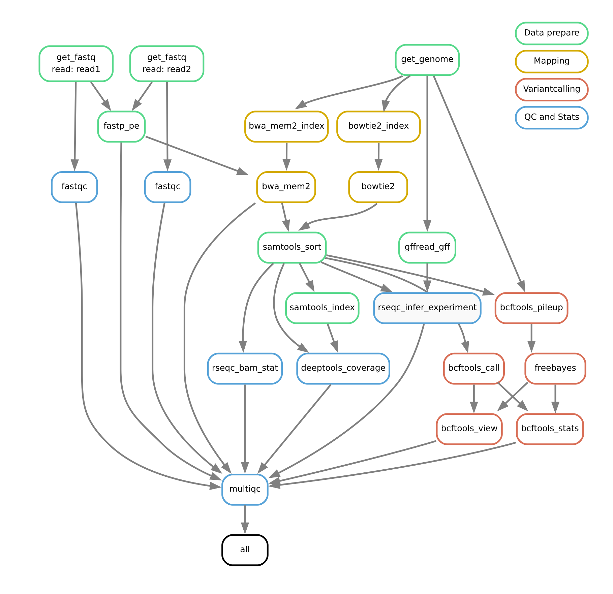

# Snakemake-simple-mapping

[](https://snakemake.github.io)
[](https://github.com/MPUSP/snakemake-simple-mapping/actions/workflows/main.yml)
[](https://docs.conda.io/en/latest/)
[](https://snakemake.github.io/snakemake-workflow-catalog/docs/workflows/MPUSP/snakemake-simple-mapping)

A Snakemake workflow for the mapping of reads to reference genomes, minimalistic and simple.
This workflow tries to be agnostic regarding the target organism, type of read input (single end or paired end, short or long), and basically anything else. You can use it for viruses, bacteria, or eukaryotes.
This simplicity comes at the cost that not every circumstance is covered (special reads, UMIs, you name it), but it will probably get the job done in most use cases.

- [Snakemake-simple-mapping](#snakemake-simple-mapping)
  - [Usage](#usage)
  - [Deployment options](#deployment-options)
  - [Authors](#authors)
  - [References](#references)

## Usage

The usage of this workflow is described in the [Snakemake Workflow Catalog](https://snakemake.github.io/snakemake-workflow-catalog/docs/workflows/MPUSP/snakemake-simple-mapping).

Detailed information about input data and workflow configuration can also be found in the [`config/README.md`](config/README.md).

If you use this workflow in a paper, don't forget to give credits to the authors by citing the URL of this repository or its DOI.

*Workflow overview:*

<!-- include overview-->


## Deployment options

To run the workflow from command line, change the working directory.

```bash
cd path/to/snakemake-simple-mapping
```

Adjust options in the default config file `config/config.yml`.
Before running the complete workflow, you can perform a dry run using:

```bash
snakemake --dry-run
```

To run the workflow with test files using **conda**:

```bash
snakemake --cores 2 --sdm conda --directory .test
```

## Authors

- Dr. Michael Jahn
  - Affiliation: [Max-Planck-Unit for the Science of Pathogens](https://www.mpusp.mpg.de/) (MPUSP), Berlin, Germany
  - ORCID profile: https://orcid.org/0000-0002-3913-153X
  - github page: https://github.com/m-jahn

## References

> Köster, J., Mölder, F., Jablonski, K. P., Letcher, B., Hall, M. B., Tomkins-Tinch, C. H., Sochat, V., Forster, J., Lee, S., Twardziok, S. O., Kanitz, A., Wilm, A., Holtgrewe, M., Rahmann, S., & Nahnsen, S. _Sustainable data analysis with Snakemake_. F1000Research, 10:33, 10, 33, **2021**. https://doi.org/10.12688/f1000research.29032.2.
